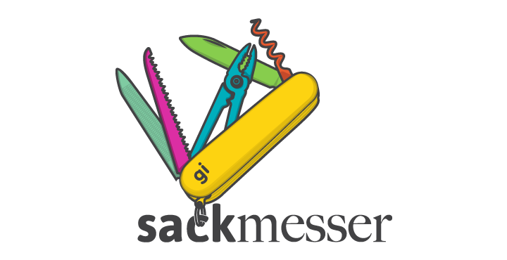

# Sackmesser




## UI Components

- [buttons](http://goldinteractive.github.io/ui-buttons/)
- [grid](http://gridle.org/)
- [slider](http://goldinteractive.github.io/ui-slider/)
- [toggle](http://goldinteractive.github.io/ui-toggle/)
- [select](http://goldinteractive.github.io/ui-select/)
- [textfield](http://goldinteractive.github.io/ui-textfield/)
- [checkbox](http://goldinteractive.github.io/ui-checkbox/)
- [radio](http://goldinteractive.github.io/ui-radio/)
- [overlay](http://goldinteractive.github.io/ui-overlay/)
- [form](http://goldinteractive.github.io/ui-form/)
- [horizontal-toolbar](http://goldinteractive.github.io/ui-horizontal-toolbar/)
- [vertical-toolbar](http://goldinteractive.github.io/ui-vertical-toolbar/)
- Effects
  - [material](http://goldinteractive.github.io/ui-effects-material/)


### How to install a Gold Interactive component
To install a ui component just use `bower install gi-ui-[name of the component] -save` for example:

```shell
$ bower install gi-ui-buttons -save
```

### How to install other frontend frameworks

Bower is designed to keep track of all the frameworks we are using in our project (jquery plugins, libraries and so on) so to install a new framework just run es:

```shell
$ bower install jquery -save
```
and it will add the new utility into the folder set inside bower.json ( by default assets/vendor/bower )

## Before installing the frontend dependencies

Please select the right setup for your project from the ``.config`` folder.
The default files contained into the root folder can be useful just for a normal html project without too much ceremony.

__Attention__: the ``.config`` subfolders could contain also other kind of assets, in that case just replace the files needed for the new project setup for example:

``.config/craft/.bowerrc`` -> ``.bowerrc``

Please once you have replaced the config files delete the ``.config`` folder

## Install all the dependencies

Use the `Makefile` to install all the project dependencies.

```shell
$ make install
```

## Configure your machine to start working with Sackmesser ( only the first time )

In Sackmesser we use several tools that must be installed on your machine before you will be able to work on a project.
Once you are sure to have the latest [nodejs](http://nodejs.org/) and ruby on your machine, you can run the command `make setup`.

## Build the project

To build the project we need to use several command line tools and bash scripts. You can have a full list of all the available tasks by typing:

```shell
$ make
```

If you just want to build the project to bring it on the live site please use:

```shell
$ make build
```

## Install new build dependencies packages

Any project is different and it could be that you may need other build steps and dependencies.

### To install a node js module just type

```shell
$ npm install yourmodule --save-dev
```

### New bash script

Just start writing your script in the tasks folder linking it correctly in the `Makefile`

## Code Guidelines

### Scss

Please avoid the use of camel case variables in your scss files
```scss

// WRONG!
$buttonColor: #fff;

// GOOD!
$button-color: #fff;

```

Use always the single quotes in the sass and the javascript files

```scss
// WRONG!
$foo: "my string";

// GOOD

$foo: 'my string';

```

#### References

- [sass-guidelines](http://sass-guidelin.es/)


# Other Links

- [Changelog](CHANGELOG.md)
